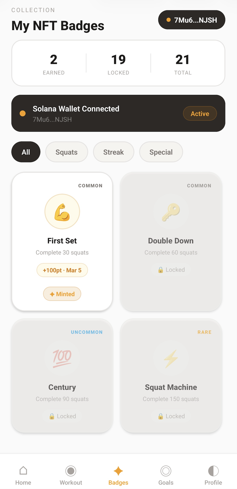
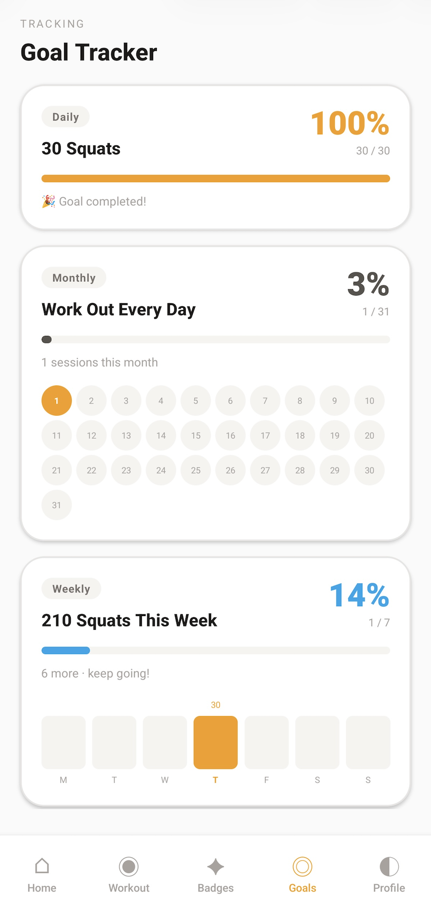
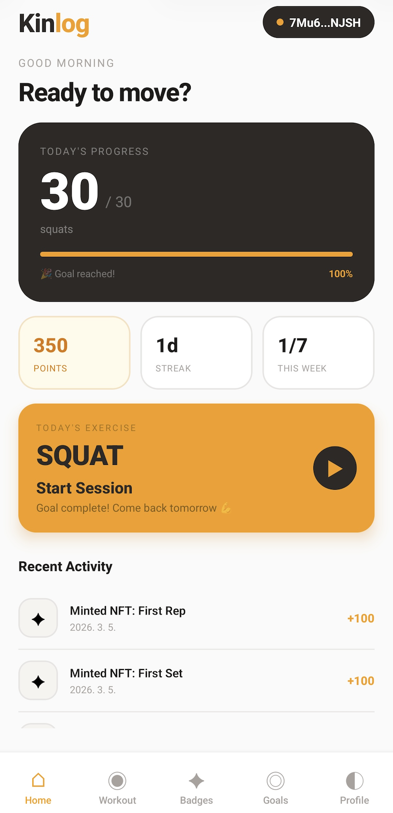
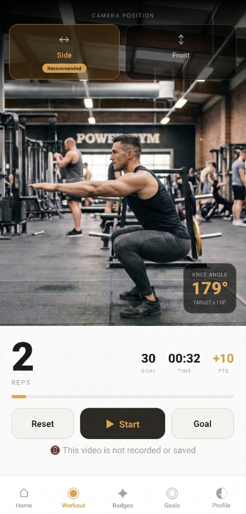
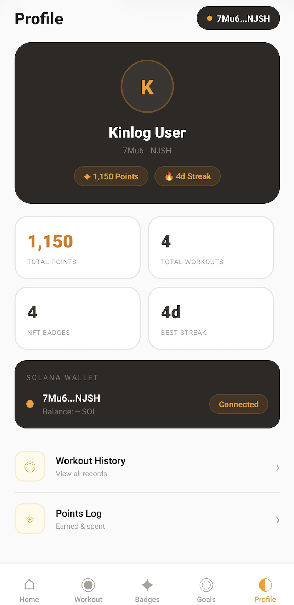

# Kinlog 🏋️
> *Kinesiology + Log — Recording movement. Preserving the most human thing we do.*

Built for the MONOLITH Solana Mobile Hackathon 2026 by a Physical Therapist & Athletic Trainer.

---

## The Question That Started Everything

**What does it mean to be human in the age of AI?**

I'm a physical therapist and athletic trainer. Every day, I evaluate how people move, how they act, how they function, how they live.

The population is aging faster. Desk jobs are multiplying. The average person now sits for over 10 hours a day. Everyone knows they should exercise. Most don't know if they're doing it right. And ironically, as AI gets smarter, humans have even less reason to use their bodies.

We outsource our thinking to AI. We outsource our memory to AI.

But there's one thing AI cannot do for you.

**It cannot sweat for you. It cannot endure for you. It cannot get back up for you.**

The more AI advances, the more physical movement becomes a distinctly human act. Thinking, judging, creating, AI can do those things. But the moment you decide to do one more rep when your legs are burning. The moment you stand back up. That is still yours. That will always be yours.

That's still yours. That will always be yours.

---

## Why Web3?

Web3 is built on ownership. 
You own your wallet, your assets, your history. 
But what about your body?  
Your fitness history belongs to a corporation. Your achievements disappear when the app does. 

Kinlog puts that on-chain. Your effort, permanently yours.

Every exercise you complete is recorded on Solana, permanently, immutably, owned by you. Not as a number in a database. As an on-chain proof of effort. An NFT badge that no one can take away.

**Because the most human thing you do deserves to be owned by you.**

This is why Web3 people should care about fitness. And why fitness people should care about Web3. Movement is the original proof of work.

---

## What is Kinlog?

Kinlog is a fitness dApp that uses AI-powered motion recognition to count squat reps in real time — no wearables, no gym equipment needed. Just your phone and your body.

Complete your daily 30-squat goal. Build streaks. Earn NFT badges on Solana Mainnet. Own your fitness history forever.

Built by a licensed Physical Therapist who got tired of watching people move less and less.
I decided to do something about it.

---

## The Algorithm Came From the Clinic

The squat detection isn't arbitrary.

MediaPipe's AI tracks 33 joint landmarks in real time. Kinlog uses three: **hip, knee, ankle.**

- Below **110°** = counted as "down"
- Above **160°** = counted as "up"
- Only this sequence = 1 rep

Why these numbers? Too shallow and there's no training effect. Too deep and you stress the knee cartilage. These thresholds come from years of working with athletes and patients — from a physical therapist who has watched thousands of squats.

but, These thresholds were set with one priority in mind: making movement accessible. 
The goal is habit formation, not perfection. 
Low enough to be effective, forgiving enough to keep you coming back.
For the first time, years of clinical knowledge became a single algorithm

---

## Features

- **AI Motion Detection** — MediaPipe Pose Landmarker, clinically calibrated squat counting
- **Real-time Angle Display** — See your knee angle live on screen
- **Daily Goals** — 30 squats/day with weekly and monthly targets
- **NFT Badges** — 21 badges across 4 rarity tiers, minted on Solana Mainnet
- **Streak Tracking** — Firebase Firestore tracks your consistency
- **On-chain Records** — Every achievement permanently recorded on Solana
- **No wearables needed** — Just your phone camera

---

## Tech Stack

| Layer | Technology |
|-------|-----------|
| Mobile | React Native (Expo bare workflow) |
| Motion AI | MediaPipe Pose Landmarker (native Kotlin module) |
| Camera | react-native-vision-camera |
| Blockchain | Solana Mainnet-Beta |
| Wallet | Solana Mobile Wallet Adapter (MWA) |
| Backend | Firebase Firestore |
| Target Device | Solana Seeker (Android) |

---

## How It Works

1. Open the app and connect your Solana wallet
2. Go to the Workout screen — position yourself so your full body is in frame
3. The AI tracks your hip, knee, and ankle in real time
4. Squat below 110° knee angle → stand above 160° → that's 1 rep
5. Hit 30 reps to complete your daily goal
6. Earn points, build streaks, mint NFT badges as permanent proof

## Screenshots

---

## NFT Badges

21 unique badges across 4 rarity tiers:

| Tier | Examples |
|------|---------|
| 🟤 Common | First Squat, 3-Day Streak, Daily Goal |
| 🟢 Uncommon | Week Warrior, 50 Squats, Consistency |
| 🔵 Rare | Monthly Master, 500 Squats, Iron Will |
| 🟡 Legendary | Centurion, Streak Legend, Elite Athlete |

---

## The Build

This app was built solo by a physical therapist. Not a developer. 
Someone who spent more time studying the human body than writing code.

With a little help from AI (Claude), the gap between knowledge and creation disappeared. 
What mattered was having something worth building.

Movement is the most honest thing a person can do. 
You cannot fake Exercise. 
You cannot cheat a streak. 
The body doesn't lie.

We built Kinlog because we believe the world is better when people move. 
When habits are formed. When effort is owned. 
We hope this app becomes a small part of someone's daily life, and brings them a little more joy, consistency, and pride in showing up for themselves.

---

## Privacy & Legal

- [Privacy Policy](./PRIVACY_POLICY.md)
- [Terms and Conditions](./TERMS_AND_CONDITIONS.md)

---

## Builder

**Jamie Lim**
Licensed Physical Therapist & Certified Athletic Trainer
Built solo for the MONOLITH Solana Mobile Hackathon 2026
